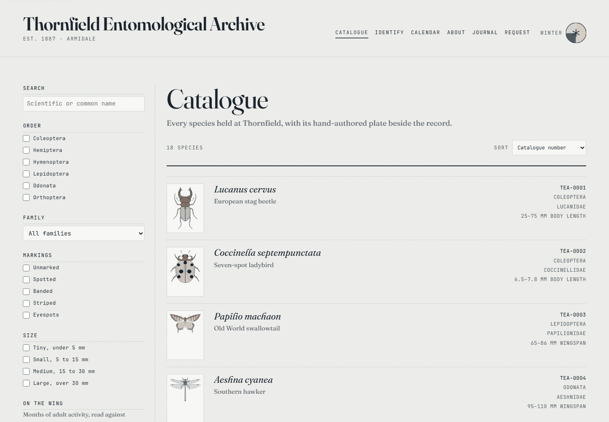
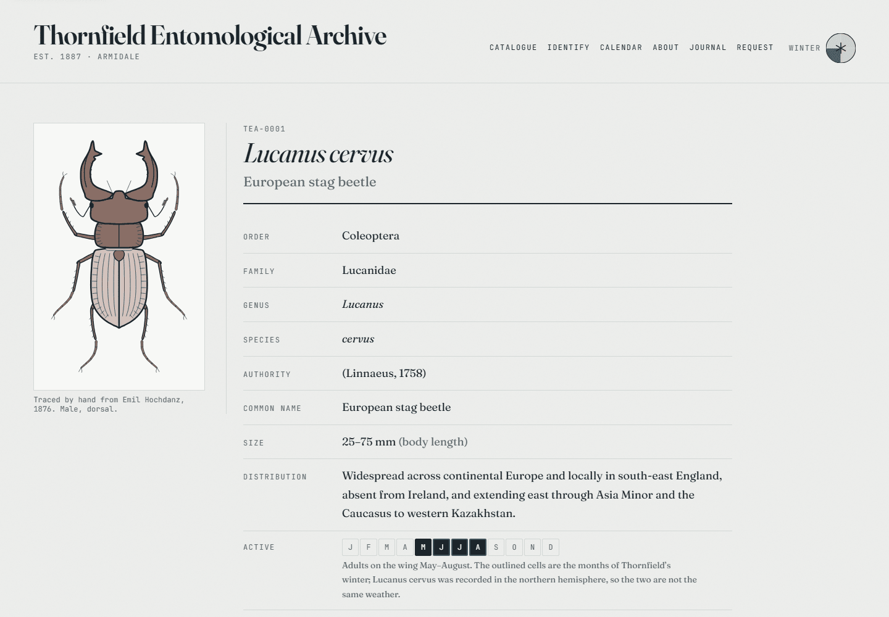
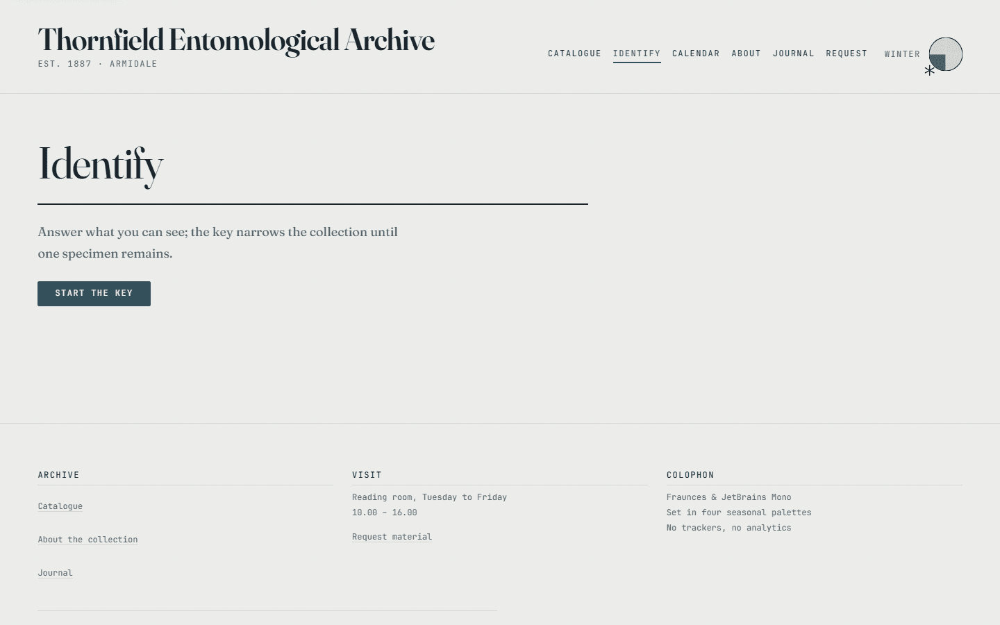
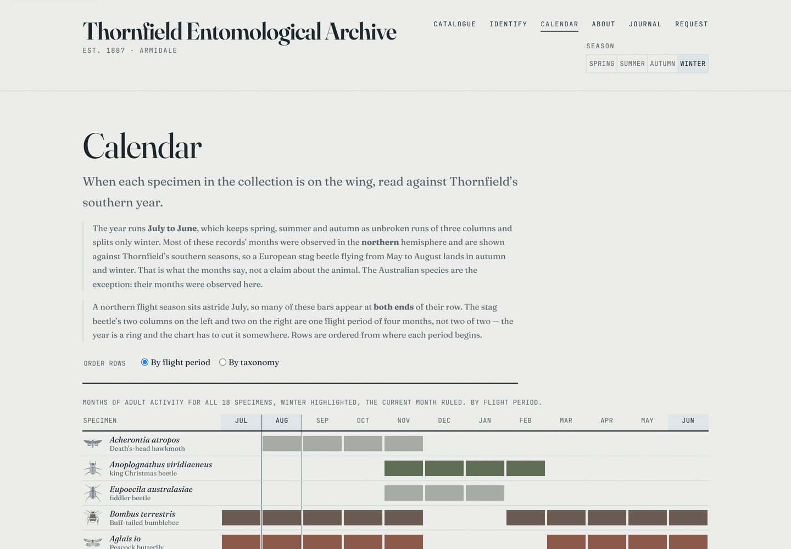

# Thornfield Entomological Archive

The public face of a collection that does not exist, built to the standard of
one that does. Eighteen real insect species, each with a sourced accession
record — taxonomy, distribution, months on the wing, and the six morphological
characters an identification key filters on — and each illustrated by a
**hand-authored plate traced from a public-domain engraving**. The site reads
like an archive rather than an app: typography and paper instead of imagery,
a ledger instead of a grid, and a palette that shifts with the Southern
Hemisphere season, so the collection is dressed differently in July than in
January.



**The institution is invented. The collection is not.** Every species is real,
every record is cited, and every drawing is traced from a named engraver's
plate whose licence is recorded in [references/SOURCES.md](references/SOURCES.md).
Nothing is collected from anyone who visits — there is no analytics, no third
party, and no endpoint. See [Limitations](#limitations), which says plainly
where the fiction stops.

|                  |                                                                                                     |
| ---------------- | --------------------------------------------------------------------------------------------------- |
| **Stack**        | Vite · React 19 · react-router 8 (data router) · TypeScript 6 strict · vanilla CSS Modules · Vitest |
| **Tests**        | 1,071 across 63 files                                                                               |
| **Collection**   | 18 species, 6 orders, 18 plates, 18 traced references                                               |
| **Lighthouse**   | Performance 88 · Accessibility 100 · Best practices 100 · SEO 100                                   |
| **Runtime deps** | four: `react`, `react-dom`, `react-router`, `zod`                                                   |

```bash
nvm use && npm install && npm run dev
```

---

## How this evolved

The archive has been three things, and the reasoning is worth keeping, because
each step was a decision to throw work away.

**1. A herbarium with a procedural plant generator.** Invented species drawn
from a seeded parameter set — a stem, a branching rule, leaves, a flower. It
worked, and it was the wrong thing to have built. Every specimen was plausible
and none was _anything_: the records were fiction, so the illustrations had
nothing to be faithful to, and there was no way to tell a good drawing from a
bad one because there was nothing to compare either against.

**2. Real insects, still procedurally generated.** Beetles and moths from
presets, with a pigment system, a three-rank line hierarchy, hatching, and
bilateral symmetry from one authored half. Much better, and it hit a ceiling no
amount of parameter tuning would move: the generator could draw a plausible
beetle but not a _particular_ one. Asked for _Lucanus cervus_ it produced a
beetle with big jaws, which is not the same animal.

**3. Hand-authored plates of real species.** Where it is now. Eighteen species
across six orders — seven beetles, three Lepidoptera, three Hymenoptera, two
Odonata, two true bugs and a cricket — chosen so the schema had to cope with
hard wing cases, leathery ones, spread wings, see-through wings and no wings at
all, rather than eighteen variations on a beetle. An author measures a
lithograph; the builder turns those measurements into path data; the schema
catches the mistakes a person drawing coordinates by hand actually makes.

What survived all three: the plate is **pure data**, the renderer turns it into
SVG, and the stylesheet turns roles into ink — neither side knows the other's
vocabulary. So did the symmetry trick: the author draws the right half and the
renderer reflects it, so a plate cannot come out lopsided.

The generators are gone from the tree. Read the history if you want them:
`git log -- src/lib/plant src/lib/insect`.

---

## Architecture

### The plate system

Four stages, and each one exists because the stage before it could be wrong in
a way nothing would notice.

```
landmarks/<slug>.json     measured off the reference, by hand
        │  npm run plate:build          (deterministic; plate:verify compares bytes)
        ▼
<slug>.plate.ts           generated path data + roles — no colours, no sizes, no left half
        │  validatePlate()             (eight error classes, in a test for every plate)
        ▼
SpeciesIllustration       mirrors, clips, stacks → SVG
        │  CSS Modules                 (roles → ink; the season decides what ink is)
        ▼
one drawing that works at 80 px and at 600
```

**Plate space.** The midline is `x = 0`; `y` runs from 0 at the head end to 1000
at the abdomen tip. Every species is measured on the same axis, so
"broader than the rose chafer" and "stouter legs than the ground beetle" are
assertions a test can make in numbers. Appendages leave that band freely — a
stag beetle's tarsi reach past 1200 — and the frame is measured from the drawing
rather than assumed.

**Authors draw the right half only.** The renderer reflects it, which is the
entire bilateral-symmetry mechanism. It is also why the validator matters: a
stray minus sign puts a leg on the wrong side, the mirror puts a second copy on
top of it, and the plate renders, looks nearly right, and has five legs. That
happened, went unnoticed for a fortnight, and is
[written up in the journal](src/content/journal/five-legs.md). The check that
would have caught it now names eight classes of mistake, all of the same kind:
ones that produce a plausible drawing rather than a broken one.

**The builder is deterministic on purpose** — fixed rounding, no clock, no
randomness — so `npm run plate:verify` can compare bytes. That is what stops
somebody fixing a wing in the generated file and losing it on the next build.

Every plate answers the same six-part contract (`src/test/plateContract.ts`) and
then adds what is true of that animal alone. The fiddler beetle's test asserts
that its wing case is the _pale_ fill and its pattern the dark one, because
drawn the other way round it satisfies every generic test and looks like a
different insect.



### The identification key

`src/lib/key` is pure data out, and the key is **derived, never written**. Each
`Morphology` field is a question, each state of its union an answer, and
`buildKey` chooses at every node the question with the most information gain
over the species still in play. A species is keyable the moment its record
exists; no branch mentions an animal.



Three things make it usable rather than merely correct:

- **The lay label is the product.** The record says `lamellate`; the key asks
  "What do the antennae look like?" and offers "Ending in a stack of flat
  plates". Labels are `Record<Union, string>`, so a new character state fails
  the build until somebody writes words a visitor could act on.
- **Information gain is weighted, and colour is held back.** Raw gain opened the
  key by asking a reader to pick one of seven colours, and keyed out seven of
  the eight species it then held in two questions — a menu, not a key. So
  structure is weighted ahead of surface, and a separate hard rule refuses a
  colour question above a depth threshold unless nothing else separates
  anything. Two mechanisms, because a weight is a ratio and cannot promise "not
  before question three"; the rule can.
- **An answer shows a count, never a name.** Naming the species behind an answer
  would key the collection out on the first screen.

Depth is pinned by a test that prints it, under a ceiling of five. It is four
today, for eighteen species, with eighteen leaves — every record keys out alone.

### The theme engine

`src/styles/tokens.css` is three layers, and components may only touch the
middle one.

1. **Primitives** — raw values named for the material: `--paper-warm-100`,
   `--ink-irongall-900`, `--leaf-russet-600`. Context-free.
2. **Semantic tokens** — roles: `--color-bg`, `--color-ink`, `--color-accent`,
   plus the spacing, type, radius, duration and easing scales.
3. **Seasons** — `<html data-season="…">` remaps the semantic _colour_ tokens
   and nothing else. Spacing, type and motion are identical across all four, so
   re-theming can never shift the layout.

| Season | Months (SH) | The idea                                                         |
| ------ | ----------- | ---------------------------------------------------------------- |
| Spring | Sep–Nov     | New growth on pale wash paper; deep green-black ink, young olive |
| Summer | Dec–Feb     | Sun-bleached sheets, dried grass; sepia ink, ochre               |
| Autumn | Mar–May     | Pressed leaves on tanned card; walnut ink, russet                |
| Winter | Jun–Aug     | Iron-gall ink on frost-grey stock; slate                         |

All four are light and paper-based, varying in hue and warmth rather than
luminance — which is what keeps contrast stable. Every semantic ink colour
clears WCAG 2.2 AA against its own season's background, and a token test reads
the stylesheet as text to prove no season is missing a pigment, because a
missing one does not fail to compile: it falls back to the neutral default and
renders a whole season's specimens in the wrong ink.

The season resolves from today's date through a pure function over meteorological
whole months, so it needs no ephemeris and is unit-tested for all twelve. Because
the palettes live entirely in CSS, the neutral default renders correctly even if
the JavaScript never runs.

### URL state

**Everything a reader can change lives in the URL, and nothing lives in a
store.** There is no state manager, and none is needed: the catalogue's filters,
the calendar's row order, the key's answers and the request form's preselected
specimen are all query parameters, so every view a reader reaches is a view they
can send to somebody else.

The URL is treated as untrusted input. `src/lib/catalogue/query.ts` drops unknown
values, normalises facet order so two equivalent links parse identically, and
trims and caps the search term.

The key's encoding is the interesting one. An answer travels as a **hash of the
trait's name and the value's name**, four base-36 characters each — not as a
branch index, and not as a position in the union. Both of those were tried:
positions are shorter and silently mean something else the moment the union
grows in the middle, which it did, twice, when `hemelytra` was added for the
shield bug and `tegmina` for the cricket. A name hashes to itself wherever it
sits. Carrying the _question_ as well as the answer is what lets a stale link
stop where the tree and the link disagree, instead of confidently keying out the
wrong animal.



### Security posture

- **No third parties.** No analytics, no trackers, no external scripts, no font
  CDN, no embeds. Nothing about a visitor leaves their browser.
- **Strict CSP:** `script-src 'self'`, `style-src 'self'`, `connect-src 'self'`,
  `object-src 'none'`, no `unsafe-inline` and no `unsafe-eval`. Nothing in the
  app needs an inline script or an inline style — CSS Modules compile to an
  external stylesheet, and the plates carry their per-element values as SVG
  presentation attributes rather than a `style` attribute. `modulePreload.polyfill`
  is off because the polyfill would inject an inline script.
- **The policy is written twice, and a test enforces that they agree.** The
  authoritative copy is a response header in `public/_headers`; `index.html`
  carries the same policy **minus `frame-ancestors`** as a fallback for hosts
  that ignore that file. The split exists precisely because browsers _ignore_
  `frame-ancestors` in a `<meta>` tag and log an error saying so — which is
  worse than useless, since it reads as clickjacking protection that is not
  there. `src/test/securityHeaders.test.ts` parses both real files and fails if
  they drift by so much as a directive.
- **The dev server is relaxed, the build is not.** Vite needs an inline Fast
  Refresh preamble, inline `<style>`, and an HMR socket. Rather than weaken the
  shipped policy, a plugin with `apply: 'serve'` rewrites the meta tag on the
  dev server only. Build output is untouched.
- **Markdown never becomes an HTML string.** The journal's parser returns blocks
  and spans and the renderer builds real elements, so there is no
  `dangerouslySetInnerHTML` in that path at all. A sanitiser runs anyway, on
  first-party content, because a property that has to be _maintained_ is one
  somebody will eventually break.
- **The origin is written once.** `src/data/site.ts` is the only place the
  hostname appears in a form anything reads; a test asserts `index.html`,
  `robots.txt` and `sitemap.xml` all agree with it and that no placeholder
  survives.

### Accessibility

- One `<header>`, one `<main id="main">`, one `<footer>` per page; a skip link
  is the first focusable element, and `#main` carries `tabIndex={-1}` so
  following it moves focus rather than only scroll position.
- A visible `:focus-visible` ring on everything focusable, built from tokens so
  it recolours with the season.
- `prefers-reduced-motion` is honoured through the duration tokens, which go to
  zero — which disables every transition in the project, because no component is
  permitted to hard-code a duration.
- The calendar is **a real table** with a `<caption>` and `scope` on both axes,
  and each cell carries its state as visually hidden text: a filled square is
  not a fact a screen reader can read. One summary sentence per row was tried
  and rejected — a row header is announced again for every cell beside it, so a
  twelve-word summary there is read twelve times. It lives on the link instead.
- The key's options are **buttons, not radios**, because choosing an answer
  navigates, and a radio that navigates is a radio lying about what it does. The
  heading takes focus on each answer, since answering changes the query string
  and the layout only moves focus when the _path_ changes.
- Form errors are named by `aria-describedby` in hint-then-error order, only for
  the ones that exist; the invalid rule is heavier as well as accented, because
  colour alone says nothing to a reader who cannot see it. A test resolves the
  attribute, because a dangling id fails silently.
- `eslint-plugin-jsx-a11y` runs on every commit and in CI. It is a floor, not a
  substitute for keyboard-testing the thing.

### Testing

**1,071 tests across 63 files**, colocated with what they cover. The strategy is
less about coverage than about which failures are _silent_:

| What                              | How it is tested                                                                                          |
| --------------------------------- | --------------------------------------------------------------------------------------------------------- |
| Pure logic (`src/lib`, `scripts`) | Plain unit tests. Most of the project's rules live here.                                                  |
| Components                        | Queried by role and text — never by test id or class.                                                     |
| Plates                            | One shared six-part contract, plus per-species assertions measured in plate space against _other_ plates. |
| Generated files                   | `plate:verify`, `sources:verify` and `seo:verify` compare bytes in `npm run check`.                       |
| Config that is written twice      | Tests that parse the real files: the two CSP copies, the four copies of the origin.                       |
| Design tokens                     | The stylesheet is read as text, because a missing token does not fail to compile.                         |

The rule the suite is built on: **anything true in two places gets a test that
they agree.** That is where this project's bugs have actually come from — a
range typed into the 404 page that named a prefix the archive had stopped using,
a description of "every record" that stopped being true when two Australian
species arrived, a sitemap that would silently omit a specimen.

`npm run check` runs lint → typecheck → the three verifiers → tests → build, and
is what the pre-push hook and CI both run.

### Build output

Route-level code splitting with react-router's own `lazy`, and chunk groups
declared by **lifetime** rather than by route:

| Chunk              | Size        | gzip    | Notes                                                |
| ------------------ | ----------- | ------- | ---------------------------------------------------- |
| `vendor`           | 280.3 kB    | 88.9 kB | react, react-dom, react-router                       |
| `plates`           | 257.6 kB    | 89.7 kB | the eighteen drawings — **not** on the critical path |
| `RequestRoute`     | 68.8 kB     | 19.3 kB | zod, and only on `/request`                          |
| `records`          | 58.7 kB     | 17.5 kB | species records and provenance                       |
| `index` (entry)    | 20.9 kB     | 7.0 kB  |                                                      |
| seven route chunks | 2–9 kB each |         |                                                      |

The plate data is the interesting one. `@/data` is the _records_; drawings come
from a separate entry point whose own module comment explains what importing it
costs. The catalogue is eagerly loaded (it is the landing page), so anything it
reaches is on the critical path — which is how 258 kB of beetle came to be
`modulepreload`ed ahead of the first paint. Its thumbnails now load after the
page does, through a dynamic import behind a frame that already has its final
size.

---

## Limitations

Stated here rather than left for a reader to discover.

- **The institution is fictional.** Thornfield, its founding year, its town and
  its reading-room hours are invented, and live in one module that says so. No
  structured data on the site claims otherwise: there is no `Organization` and
  no `Museum` node anywhere, and a test enforces it — a machine-readable claim
  that an entomological collection exists in Armidale would be read by crawlers
  that never see the paragraph disclaiming it. The `/about` page owns up in full.
- **The request form files nothing.** There is no endpoint, no fetch and no
  third party. Submitting validates, mints a reference number from a hash of
  what was typed, and shows a panel. The notice saying so sits **above** the
  form, not only in the confirmation — somebody typing their email address into
  a fictional institution's form deserves to know beforehand.
- **The months and the seasons come from different hemispheres.** Thornfield
  keeps a southern calendar; sixteen of the eighteen records had their flight
  months observed in the northern one, so a European stag beetle flying May to
  August is reported as autumn and winter. That is a relabelling, not a claim
  about the animal, and the calendar, the filter panel and every specimen sheet
  say so in words. The two Australian scarabs carry `monthsHemisphere:
'southern'` and their pages say nothing about a mismatch, because they have
  not got one.
- **Performance is 88, not ≥95, and the gap is entirely the largest contentful
  paint** — 3.8 s, of which 88% is render delay on an element that is a
  paragraph of plain text. Observed FCP and LCP are both about 105 ms; the rest
  is Lighthouse's model of a throttled mobile network against a client-rendered
  app. Prerendering the routes to static HTML at build time would remove it, and
  the site is a good candidate — every byte of data is a compiled-in module
  constant, so hydration needs no serialised state. It is an architectural
  change, and it has not been made.
- **`/lab/plates` is dev-only** and deliberately unbuildable: it displays the
  traced references, which must never ship. The branch is behind
  `import.meta.env.DEV` and a dynamic `import()`, so the module is not emitted
  at all rather than bundled and merely unreachable.
- **The plates are drawings, not photographs.** Two of them record a correction
  in prose because the reference would not support the measurement — the field
  cricket's only usable figure is a habitat scene, and the king Christmas
  beetle's is drawn rolled onto its side. In both, proportions came from the
  published measurements and only the arrangement from the reference.
  [references/SOURCES.md](references/SOURCES.md) says which, and why.

---

## Getting started

Requires Node 24 (see `.nvmrc`).

```bash
nvm use && npm install && npm run dev
```

`/lab/plates` is available on the dev server only: every plate at 80, 240 and
600 pixels, in the current season, with its alt text, its reference and the
validator's verdict printed on the page.

### Scripts

| Script                                          | What it does                                                          |
| ----------------------------------------------- | --------------------------------------------------------------------- |
| `npm run dev`                                   | Vite dev server with HMR                                              |
| `npm run build`                                 | Typecheck, then build to `dist/`                                      |
| `npm run preview`                               | Serve the built `dist/` locally                                       |
| `npm run check`                                 | lint → typecheck → verifiers → test → build. **Before every commit.** |
| `npm run lint` / `lint:fix`                     | ESLint over the whole project                                         |
| `npm run format` / `format:check`               | Prettier, writing or failing                                          |
| `npm run typecheck`                             | `tsc -b` across both project references                               |
| `npm run test` / `test:watch` / `test:coverage` | Vitest                                                                |
| `npm run plate:build` / `plate:verify`          | landmarks → `*.plate.ts`, and the byte check                          |
| `npm run sources:build` / `sources:verify`      | `src/data/references` → `references/SOURCES.md`                       |
| `npm run seo:build` / `seo:verify`              | `robots.txt` and `sitemap.xml`                                        |
| `npm run og:build`                              | `public/og-image.png`, composed from the stag plate and the wordmark  |

### Adding a species

A record in `src/data/species`, a landmark file in
`src/data/species/landmarks`, a test that calls `describePlateContract`, a
reference in `references/` with its entry in `SOURCES.md`, and two lines in
`src/data/species/index.ts`. It touches no component, and the key, the
calendar, the filters and the sitemap all pick it up on their own.

---

## Tooling

Kept deliberately small. Everything below earns its place; what did not is
listed under _Deliberately absent_.

| Package                                                                 | Why                                                                                                                                                                                                                                         |
| ----------------------------------------------------------------------- | ------------------------------------------------------------------------------------------------------------------------------------------------------------------------------------------------------------------------------------------- |
| **vite** + **@vitejs/plugin-react**                                     | Build tool and dev server. Outputs a plain static bundle.                                                                                                                                                                                   |
| **react**, **react-dom**                                                | The UI library.                                                                                                                                                                                                                             |
| **react-router**                                                        | Routing via the data router API, for loaders, actions and per-route error boundaries.                                                                                                                                                       |
| **zod**                                                                 | Schema validation for the request form. A dozen rules, each with a message a human reads; a hand-rolled validator's messages drift from the fields they describe. Nothing else uses it, and nothing else should until a second form exists. |
| **typescript**                                                          | Strict, with `exactOptionalPropertyTypes` and `noUncheckedIndexedAccess`.                                                                                                                                                                   |
| **vitest**                                                              | Shares Vite's transform pipeline, so tests and app resolve `@/` and CSS Modules identically.                                                                                                                                                |
| **jsdom**                                                               | The DOM Vitest runs components against.                                                                                                                                                                                                     |
| **@testing-library/react** + **/dom** + **/jest-dom** + **/user-event** | Renders and queries components the way a user encounters them.                                                                                                                                                                              |
| **@vitest/coverage-v8**                                                 | Coverage, no instrumentation step.                                                                                                                                                                                                          |
| **eslint** + **@eslint/js** + **typescript-eslint**                     | Flat config, with the type-aware rules that catch real bugs rather than style.                                                                                                                                                              |
| **eslint-plugin-react-hooks**                                           | The rules of hooks, which no type checker can enforce.                                                                                                                                                                                      |
| **eslint-plugin-jsx-a11y**                                              | Static accessibility checks on JSX.                                                                                                                                                                                                         |
| **eslint-plugin-import**                                                | Ordering and duplicate detection only. Resolution is off — `tsc` reports unresolved imports better, which saves a resolver dependency.                                                                                                      |
| **prettier** + **eslint-config-prettier**                               | Formatting, with every conflicting lint rule switched off.                                                                                                                                                                                  |
| **husky** + **lint-staged**                                             | Lint and format staged files on commit; typecheck and test on push.                                                                                                                                                                         |
| **@resvg/resvg-js** + **wawoff2**                                       | Build-time only, for `og:build`: rasterise the card, and read the vendored WOFF2 faces.                                                                                                                                                     |

### Deliberately absent

No Tailwind, no CSS-in-JS, no component library, no animation library, no state
manager (the URL is the state), no `clsx` (there is a four-line `cx` in
`src/lib/classNames.ts`), no icon package, no markdown library, no analytics,
and no `eslint-import-resolver-typescript`.

### Version choices worth explaining

Two packages are **not** on their newest release, both held back by a peer range
rather than by choice:

- **TypeScript 6.0, not 7.0.** typescript-eslint 8 declares
  `>=4.8.4 <6.1.0`. Installing TS 7 would silently break every type-aware lint
  rule, which is most of the value of the lint setup.
- **ESLint 9, not 10.** `eslint-plugin-import` and `eslint-plugin-jsx-a11y` both
  cap at `^9`.

---

## Folder structure

```
.
├── .github/workflows/ci.yml  lint · format · typecheck · verifiers · test · build
├── docs/readme/              the screenshots above
├── public/
│   ├── fonts/                self-hosted variable fonts + their OFL files
│   ├── _headers  _redirects  Netlify configuration, copied to the publish root
│   ├── og-image.png          generated by `npm run og:build`
│   └── robots.txt  sitemap.xml   generated by `npm run seo:build`
├── references/               traced references + generated SOURCES.md. Never shipped.
├── index.html                CSP fallback, meta, Open Graph
├── netlify.toml              build command, publish dir, Node version, caching
├── scripts/
│   ├── plate-builder/        landmarks → *.plate.ts
│   ├── sources-builder/      src/data/references → references/SOURCES.md
│   ├── seo-builder/          → robots.txt, sitemap.xml
│   └── og-builder/           → og-image.png
└── src/
    ├── app/                  router, providers, root layout, error boundary, routes/
    ├── components/           SpeciesIllustration, Ledger, VisuallyHidden
    ├── features/             catalogue · journal · meta · theme
    ├── hooks/                shared React hooks
    ├── content/journal/      the field journal, markdown with frontmatter
    ├── lib/                  pure utilities — no React, no DOM
    │   ├── calendar/  catalogue/  journal/  key/  meta/  plate/  request/
    ├── styles/               index · tokens · reset · global · fonts
    ├── data/
    │   ├── institution.ts    the invented archive's own facts
    │   ├── site.ts           the origin, in the only place it is written
    │   ├── journal/  references/
    │   └── species/          one record, one plate and one test per species
    ├── types/                shared types
    ├── test/                 Vitest setup, the plate contract, geometry, drift tests
    └── main.tsx
```

`@/` resolves to `src/`, configured in `tsconfig.app.json`, mirrored in
`tsconfig.node.json` and in `vite.config.ts`. All three change together.

### Fonts

Two OFL-1.1 variable families, self-hosted, with their licences alongside.
Provenance and the trimming method are in
[public/fonts/README.md](public/fonts/README.md).

**Fraunces** for display and body — the optical-size axis is why it is here: one
family sets headings with the hairlines of an engraved plate and body copy with
strokes sturdy enough to survive at 16px. **JetBrains Mono** for labels and
accession numbers, which gives the ledger voice a museum label rather than a
terminal.

All five files are trimmed to what the site can render — the mono shipped 1,743
glyphs behind a Latin-only `unicode-range`, and every Fraunces face carried an
axis the stylesheet only ever sets to its default. 383 kB of preloaded font
became 196 kB, and the metric-override numbers were **checked** to be unaffected
rather than assumed. Those numbers were measured in a browser against the real
files: Fraunces sets much narrower than Georgia, so its fallback scales _down_,
which a guess would very likely have got backwards.

---

## Deployment

Netlify, from `dist/`. `netlify.toml` carries the build command, the publish
directory, the Node version and two cache rules; the files that configure the
_served_ site are copied to the publish root from `public/`:

- **`_redirects`** — the SPA catch-all, `/* /index.html 200`. It rewrites rather
  than redirects, so a deep link resolves instead of hitting Netlify's 404.
- **`_headers`** — the security headers described above, including the
  `frame-ancestors` directive that only works as a header.

Netlify will read header and redirect rules from either place, and having both
is how a site ends up with two sets of security headers where one silently wins.
So `netlify.toml` declares none — only caching, which is a different concern and
depends on a fact only the build knows: everything under `/assets/` carries a
content hash and can be `immutable`, while the HTML that points at those hashed
files must never be.

## Contributing

Conventions — exports, component layout, TypeScript flags, styling rules,
testing, the plate authoring workflow, commit format — are in
[CONTRIBUTING.md](CONTRIBUTING.md). Orientation for the parts that are easy to
get wrong is in [CLAUDE.md](CLAUDE.md).

## Licence

Code is [MIT](LICENSE).

**Fonts are not covered by it.** Fraunces and JetBrains Mono are each
distributed under the SIL Open Font Licence 1.1; keep every font file's
`OFL.txt` alongside it in `public/fonts/`.

**The traced references are not covered by it either.** Each is public domain,
and each one's artist, publication, figure and licence is recorded in
[references/SOURCES.md](references/SOURCES.md).

Thornfield is fictional. Any resemblance to a real institution is coincidental.
The species are real.
